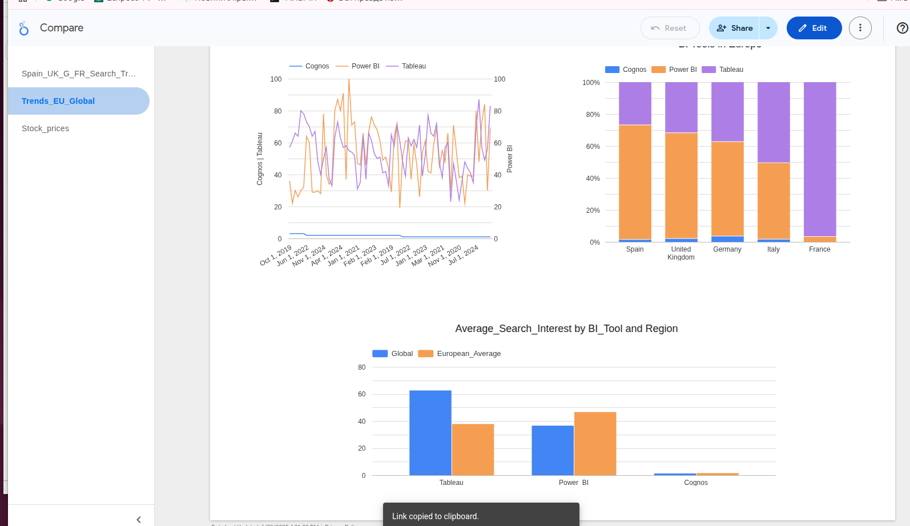
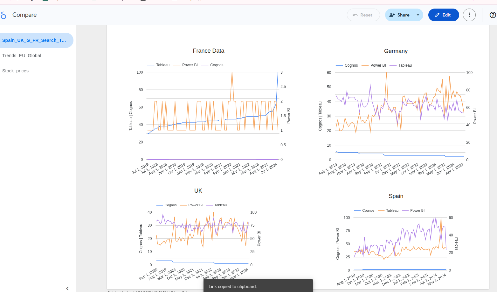
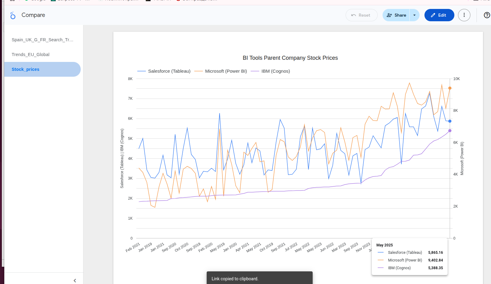

# BI Tools Market Analysis: Power BI vs Tableau vs IBM Cognos
## A Comprehensive Global and European Market Study


## 🎯 Project Overview

This project analyzes the competitive landscape of business intelligence tools through a comprehensive data-driven approach, combining search trend analysis, regional market preferences, and financial performance of parent companies.

### 📊 Live Dashboard
🔗 **[Interactive Looker Studio Dashboard]
( https://lookerstudio.google.com/reporting/210f7121-ae8b-4742-8565-49bf1bb5e190)**

*Note: Screenshots of all visualizations are available in the `/dashboard_screenshots/` folder*

## 🔍 Key Research Questions

1. **Which BI tool dominates global search interest?**
2. **How do European preferences differ from global trends?**
3. **What's the relationship between search interest and business performance?**
4. **Which tool shows the strongest growth trajectory?**

## 📈 Major Findings

### 🏆 Executive Summary
- **Power BI** shows dramatic growth from 2019-2024, overtaking established competitors
- **European markets** display distinct regional preferences with Germany leading Power BI adoption
- **Parent company stock performance** correlates with tool popularity trends
- **Search interest** serves as a leading indicator of market adoption

### 🌍 Regional Insights
| Country | Leading Tool | Key Finding |
|---------|-------------|-------------|
| Germany | Power BI | 58.9% market share by search volume |
| France | Tableau | Strong preference for advanced analytics |
| UK | Power BI | 62.0% dominance, Microsoft ecosystem effect |
| Italy | Tableau | 54.8% preference, established market |
| Spain | Power BI | 58.8% emerging market leadership |

## 🛠️ Technical Implementation

### Data Sources
- **Google Trends API** - Search interest data (2019-2024)
- **Yahoo Finance API** - Stock price data for parent companies
- **Regional Analysis** - 5 European countries + global comparison

### Tools & Technologies
```
Python Libraries:    pandas, matplotlib, seaborn, yfinance, pytrends
Visualization:       Google Looker Studio, Matplotlib
Data Processing:     Jupyter Notebook
Version Control:     Git/GitHub
```

### Analysis Framework
1. **Data Collection** - Multi-source API integration
2. **Data Cleaning** - Standardization and validation
3. **Trend Analysis** - Time series and regional comparisons
4. **Financial Analysis** - Parent company performance correlation
5. **Visualization** - Interactive dashboards and static charts

## 📁 Repository Structure

```
bi-tools-market-analysis/
│
├── 📊 data/ csv data files
│  
├── 📓 bi_tools_analysis.ipynb
│   
│
├── 📊 dashboard_screenshots/
│   ├── global_trends_overview.png
│   ├── european_regional_analysis.png
│   ├── stock_performance_comparison.png
│  
│
├── BI_Tools_Market_Analysis_Report.pdf   - report
├
└── 📖 README.md
```

## 🎨 Key Visualizations

### 1. Global Trend Analysis

*5-year search interest trends showing Power BI's dramatic rise*

### 2. European Market Breakdown

*Country-by-country preferences across 5 major European markets*

### 3. Stock Performance Correlation

*Parent company financial performance vs tool popularity*


## 💡 Business Implications

### For Organizations
- **Technology Strategy**: Power BI offers best ROI for Microsoft-integrated environments
- **Geographic Expansion**: European markets show distinct tool preferences requiring localized approaches
- **Talent Acquisition**: Skills demand varies significantly by tool and region

### For Professionals
- **Skill Development**: Power BI skills show highest growth trajectory and job market demand
- **Geographic Opportunities**: European markets offer specialized opportunities based on tool expertise
- **Career Planning**: Combining tools expertise provides competitive advantage

## 🔬 Methodology

### Data Collection Approach
- **Temporal Coverage**: 5-year analysis (2019-2024) captures full market evolution
- **Geographic Scope**: Global trends + detailed European analysis (DE, FR, GB, IT, ES)
- **Multi-dimensional**: Search trends, financial performance, regional preferences

### Analysis Techniques
- **Time Series Analysis**: Trend identification and seasonality detection
- **Comparative Analysis**: Cross-regional and cross-tool comparisons
- **Correlation Analysis**: Search interest vs business performance
- **Market Share Calculation**: Relative positioning and growth rates

### Data Quality Assurance
- **API Rate Limiting**: Implemented delays to ensure complete data collection
- **Data Validation**: Cross-verification between multiple data sources
- **Missing Data Handling**: Robust handling of incomplete time series

## 🚀 How to Reproduce This Analysis

### Prerequisites
```bash
Python 3.8+
pip install -r requirements.txt
```

### Step-by-Step Reproduction
```bash
# 1. Clone the repository
git clone https://github.com/konmez/bi-tools-market-analysis.git
https://github.com/konmez/BI_Tools_Market_Analysis
cd bi-tools-market-analysis

# 2. Install dependencies
pip install -r requirements.txt

# 3. Run the analysis notebooks in order
jupyter notebook notebooks/01_data_collection.ipynb

# 4. Or run the complete analysis script
python src/run_complete_analysis.py
```

### Configuration
- No API keys required (uses free APIs)
- Estimated runtime: 15-20 minutes
- Output: All CSV files and visualizations generated locally

## 📊 Key Metrics & Results

### Search Interest Growth (2019-2024)
- **Power BI**: +156% growth
- **Tableau**: +23% growth  
- **Cognos**: -12% decline

### European Market Share (2024)
- **Power BI**: 46.2% average across EU5
- **Tableau**: 39.8% average across EU5
- **Cognos**: 14.0% average across EU5

### Stock Performance Correlation
- **Microsoft (MSFT)**: Strong correlation between Power BI growth and stock performance
- **Salesforce (CRM)**: Stable performance aligned with Tableau's mature market position
- **IBM**: Transformation challenges reflected in both Cognos decline and stock volatility

## 🎓 Skills Demonstrated

### Technical Skills
- **Data Collection**: API integration, web scraping concepts
- **Data Analysis**: Time series analysis, statistical comparisons
- **Data Visualization**: Interactive dashboards, statistical plotting
- **Programming**: Python, pandas, data manipulation

### Business Skills
- **Market Research**: Competitive analysis, trend identification
- **Strategic Thinking**: Business implications and recommendations
- **Communication**: Clear visualization and insight presentation
- **Project Management**: End-to-end analysis execution

## 🔮 Future Enhancements

### Potential Extensions
- **Job Market Analysis**: Integration with job posting APIs
- **Social Media Sentiment**: Twitter/LinkedIn mentions analysis
- **Feature Comparison**: Detailed tool capability assessment
- **Predictive Modeling**: Forecast future market trends

### Technical Improvements
- **Real-time Dashboard**: Automated data refresh capabilities
- **Advanced Analytics**: Machine learning trend prediction
- **Interactive Features**: User-driven dashboard filtering
- **Mobile Optimization**: Responsive dashboard design

## 📚 References & Data Sources

### Primary Data Sources
- [Google Trends](https://trends.google.com/) - Search interest data
- [Yahoo Finance](https://finance.yahoo.com/) - Stock market data
- [Stack Overflow Developer Survey](https://insights.stackoverflow.com/survey) - Industry context

### Analysis Framework
- Time series analysis methodology
- Comparative market research techniques
- Financial correlation analysis approaches

## 👤 About This Project

This analysis was completed as part of a comprehensive data science portfolio, demonstrating end-to-end project execution from data collection through business insight generation.

**Connect with me:**
- 📧 Email:kmezin@yahoo.com
- 💼 LinkedIn: [www.linkedin.com/in/kon-mez-8425ab2b3](www.linkedin.com/in/kon-mez-8425ab2b3)
- 🌐 Portfolio: [https://konmez.github.io/my_portfolio/](https://konmez.github.io/my_portfolio/)

## 📄 License

[This project is not licensed under the MIT License - see the [LICENSE](LICENSE) file for details.]

---

**⭐ If you found this analysis valuable, please consider starring this repository!**

*Last updated: June 2025*